# myFTP 协议

> 请从[北大教学网](https://course.pku.edu.cn)获取本Lab任务的Github邀请链接, DDL: `2022-10-23 23:59:59`

MyFTP是我们为了方便同学们快速理解POSIX API设计的一个简单的Lab

在这个Lab中你需要完成一个简单的FTP Server和FTP Client CLI(CLI指命令行界面)

## 1. 实现要求

1. MyFTP的Client支持以下的命令
    1. `open <IP> <port>`: 建立一个到`<IP>:<port>`的连接
    2. `auth <username> <password>`: 向对侧进行身份验证
    3. `ls`: 获取对方当前运行目录下的文件列表，一个样例输出如下:
        ``` cpp
        123.txt
        ```
    4. `get <filename>`: 将Server运行目录中的`<filename>`文件存放到Client运行目录的`<filename>`中
    5. `put <filename>`: 将Client运行目录中的`<filename>`文件存放当Server运行目录的`<filename>`中
    6. `quit`: 如有连接则先断开，后关闭Client
2. MyFTP的Server需要支持如下的功能特点
    1. 权限控制: 用户需要登录这里简化为用户名为`user`密码为`123123`
    2. 获取文件列表: 这里文件列表由指令`ls`生成，可以使用`popen`或者`pipe+fork+execv`的手段获取其他进程的输出结果
    3. 下载文件
    4. 上传文件

### 1.1 Client的运行

基于“3. 如何进行本地测试”一节的描述，编译完成后，期望在build目录下生成可执行程序`ftp_client`，你可以通过在build目录中直接执行`./ftp_client`启动Client

实际测试时我们会通过在任意目录中使用`ftp_client`的绝对路径，在没有任何参数的情况下执行`ftp_client`

### 1.2 Server的运行

基于“3. 如何进行本地测试”一节的描述，编译完成后，期望在build目录下生成可执行程序`ftp_server`，你可以通过在build目录中直接执行`./ftp_server 127.0.0.1 12323`启动Server(该Server监听127.0.0.1:12323)

实际测试时我们会通过在任意目录中使用`ftp_server`的绝对路径，以参数IP和Port启动`ftp_server`分别作为Server需要监听的IP和端口

这里有一个简单的例子`cd /home/jeremyguo/tmp && /home/jeremyguo/ftp/build/ftp_server 127.0.0.1 12323`

该指令在`/home/jeremyguo/tmp`目录下启动了`ftp_server`

## 2. 技术规范

### 2.1 数据报文格式

``` cpp
struct {
    byte m_protocol[MAGIC_NUMBER_LENGTH]; /* protocol magic number (6 bytes) */
    type m_type;                          /* type (1 byte) */
    status m_status;                      /* status (1 byte) */
    uint32_t m_length;                    /* length (4 bytes) in Big endian*/
} __attribute__ ((packed));
```

Client和Server将交换协议信息，以执行各项功能。所有协议消息前面都有代码所示的协议头，基于TCP协议进行通信

即每一个802.3网络上的报文都有如下的形式:

`|802.3 Header|IP Header|TCP Header|myFTP Header|myFTP Data|`

其中TCP Header以及之前的头会由系统生成, 我们要实现的是一个应用层协议，也就是myFTP Header以及以后的内容

我们添加`__attribute__ ((packed))`以避免数据结构对齐产生的问题

### 2.2 myFTP Header格式

文档中所称的请求为从Client发送给Server的报文，回复为从Server发送给Client的报文

对于所有的报文，myFTP Header中的`m_protocol`字段的值都应当为`"\xe3myftp"`(即字符'\xe3'后接字符串"myftp"共6bytes)，我们通过这个字段来辨识是否为正确的协议版本即myFTP协议

`m_type`字段标识了当前报文的类型，具体取值见2.3

`m_status`只会为0或者1, Server用该选项通知客户端当前状态，具体取值见2.3

报文的长度`m_length`为**大端法**表示，长度包括包头和数据的**总长度**, 你可以认为在任何时候报文的长度不会超过`limits.h`中定义的`INT_MAX`

### 2.3 功能描述

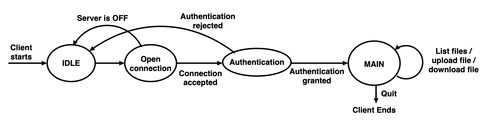

上图描述了Client的状态机, Server对于每一个Client, 以及Client自身都应当维护这样一个简单的状态机

Client在每一个时刻只能执行一个请求, 只有当一个请求执行完成后才能开始下一个

#### 2.3.1 Open a Connection

Client和Server会按照如下的步骤进行交互:

1. 当用户启动Client并输入以下命令时`open SERVER_IP SERVER_PORT`(其中`SERVER IP`和`SERVER_PORT`分别是Server的IP地址和端口号)，那么一个TCP连接应该被连接到Server的IP地址和端口。
2. 接下来，Client将向Server发送一个协议消息`OPEN_CONN_REQUEST`，请求打开一个连接。
3. 如果Server正在运行（即它正在监听Server的端口号），它将回复一个`OPEN_CONN_REQUEST`类型的协议消息。
4. 最后Client收到Server的回复

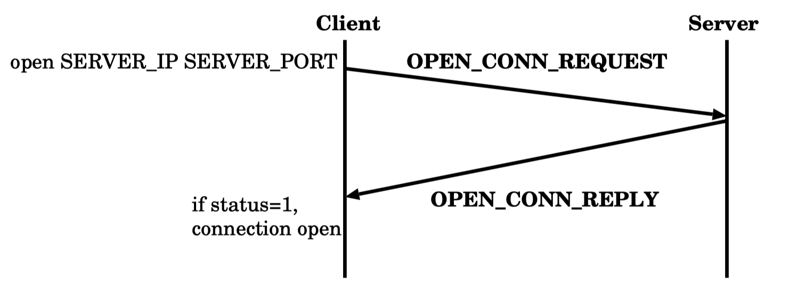

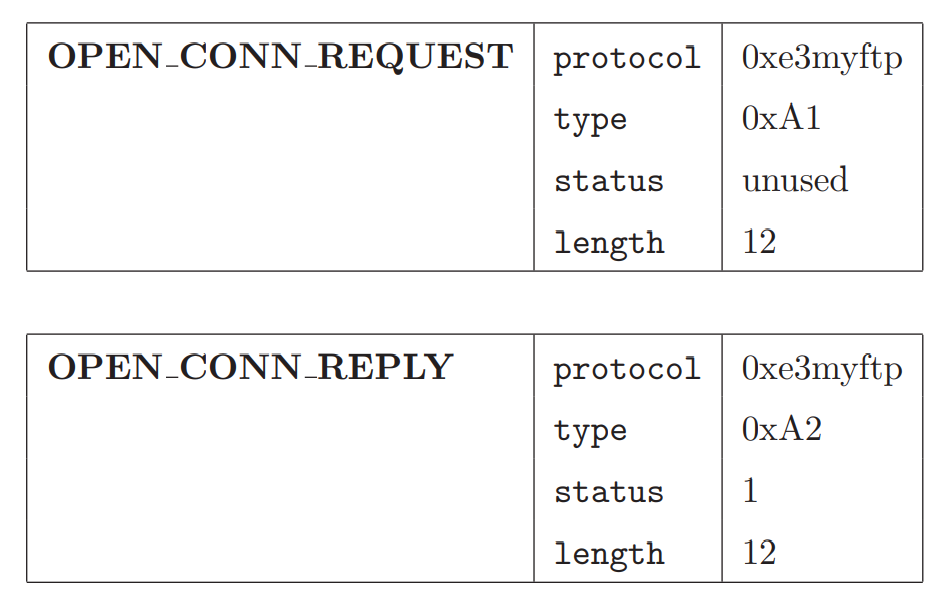

请注意：

1. 当Server启动时，他的`OPEN_CONN_REQUEST`类型的回复的`m_status=1`
2. 当一个字段被说明为未使用时，无论是Server还是Server都不会读取该字段内容。

#### 2.3.2 Authentication

连接成功后，用户需要通过`auth USER PASS`的命令来认证自己。

其中`USER`和`PASS`分别是用户名和密码。随后，Client将向Server发送`AUTH_REQUEST`类型的协议消息，其中包含用户名和密码。这里为了简化用户名为`user`密码为`123123`此时该消息的myFTP Data段应当为`"user 123123\0"`。

如果验证成功，那么Server将回复`AUTH_REPLY`类型的消息，并且`m_status`设置为1，
否则，Server将回复`AUTH_REPLY`，`m_status`设置为0。

如果Client收到的状态为0，那么它立即关闭连接（即重新转为状态机中的`IDLE`状态）。

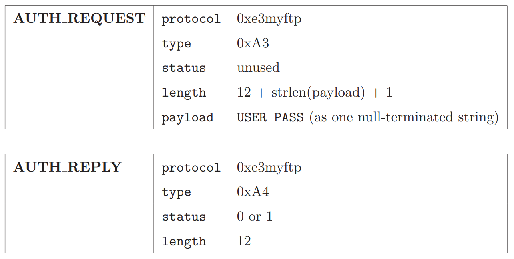

#### 2.3.3 List Files

在用户通过认证后，他可以执行主要功能。假设用户想列出存储在Server中的所有文件。用户将发出一个命令`ls`。然后，Client将向Server发送一个协议消息，类型为`LIST_REQUEST`。Server将回复一个协议消息`LIST_REPLY`以及可用文件的列表。

所有文件都存储程序的工作目录中（注意工作目录不等价于可执行程序位置，而是从何处启动了该程序）。下面列出了对资源库目录的假设：
1.	该目录在Server启动前已被创建。
2.	当Server启动时，该目录可能包含文件。
3.	该目录只包含常规文件（即没有子目录，没有链接文件等等）。
4.	Server进程有必要的权限来访问该目录以及该目录内的文件。
5.	文件只包含一下一组字符：字母（a-z和A-Z）和数字（0-9）。
6.  在该目录下执行`ls`指令，其返回的结果的总长度不会超过2047个字符

要在Server端读取目录，你可以使用`popen`获取Linux中`ls`程序执行的返回结果，并将其结果返回，注意返回的内容结尾应当增加一个`\0`以表示内容结束。

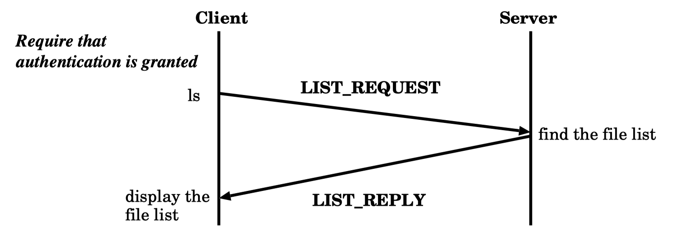

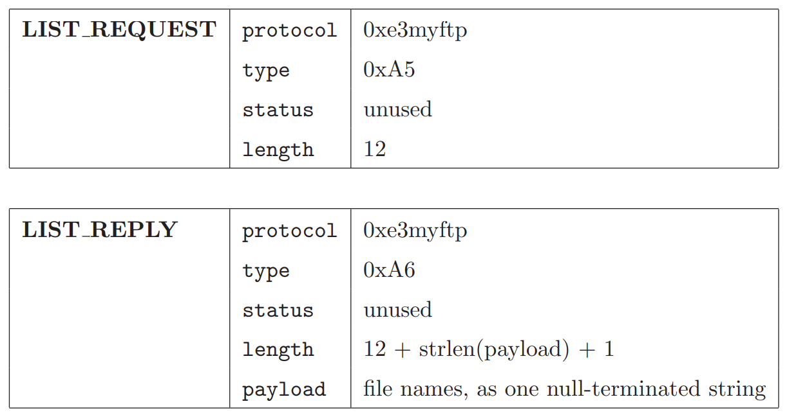

#### 2.3.4 Download Files

假设用户想从Server上下载一个文件，然后他发出了一个命令`get FILE`, 其中`FILE`是要下载的文件的名称。
然后，Client将向Server发送一个协议消息`GET_REQUEST`。Server将首先检查该文件在其资源库目录中是否可用。
如果文件不存在，Server将回复一个协议消息`GET_REPLY`，`m_status`设置为0。
如果文件存在，Server将回复一个协议消息`GET_REPLY`，`m_status`设置为1。
以及一个包含文件内容的`FILE_DATA`消息。

请注意，一个文件可以是ASII或二进制模式。你应该确保ASCII和二进制文件都被支持。此外，该程序将覆盖现有的本地文件。
在这里，我们假设对于每个Client，在用户发出下一个命令之前，一次只下载一个文件。下图展示了如何下载文件的消息流。

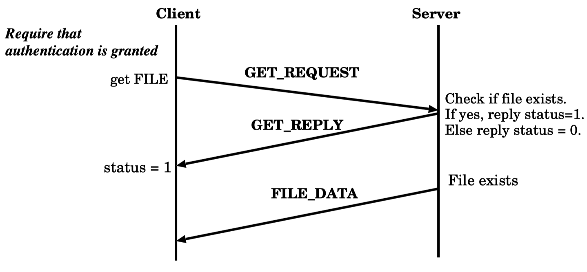

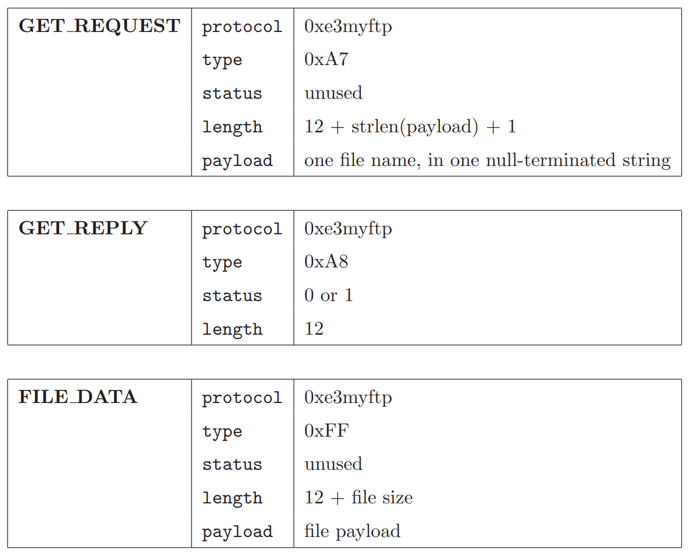

#### 2.3.5 Upload Files

假设用户想上传一个文件到Server。然后，他发出一个命令`put FILE`,其中`FILE`是要上传的文件的名称。
首先，Client将检查该文件是否存在于本地（即在Client）。如果不存在，Client将显示一个错误消息，说明该文件不存在。
如果文件在本地存在，那么Client将向Server发送一个协议消息`PUT_REQUEST`。
Server将回复一个协议消息`PUT_REPLY`并等待文件。然后，Client将发送一个包含文件内容和`FILE_DATA`消息。

这里，我们假设上传的文件与Client程序驻留在同一目录下。
另外，在用户发出下一个命令之前，每次只上传一个文件。
最后，Server将上传的文件存储在其工作目录下，使用用户提供的名称。
注意，Server可能会覆盖现有的文件。
同样，所有文件可以是ASCII码，也可以是二进制。你应该确保二进制文件被支持。
下图显示了如何上传一个文件的消息流。

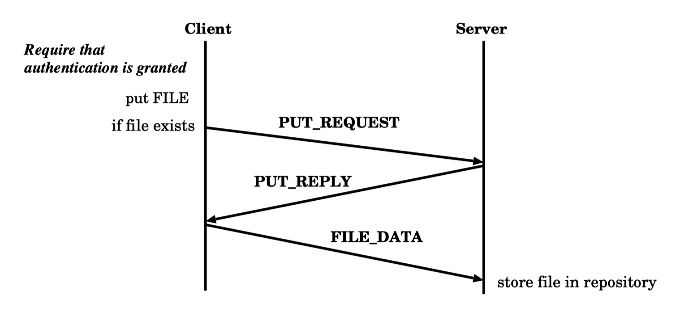

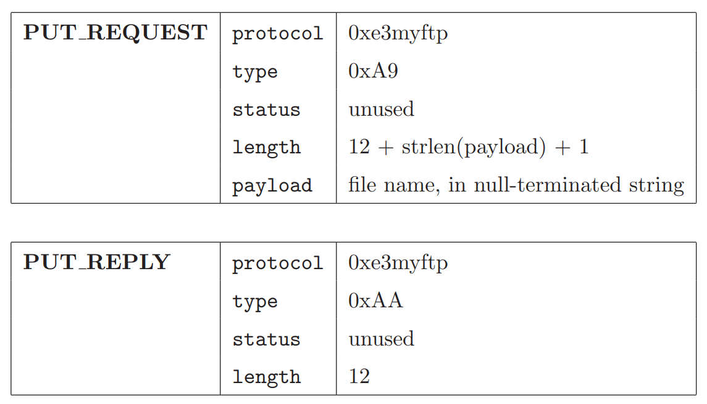

#### 2.3.6 Close Connection

为了关闭连接，用户发出`quit`的命令。
Client将向Server发送一个协议消息`QUIT_REQUEST`。
Server将回复一个协议消息`QUIT_REPLY`给Client，而Client应该释放连接（即关闭TCP连接）。
最后，Client程序将退出。

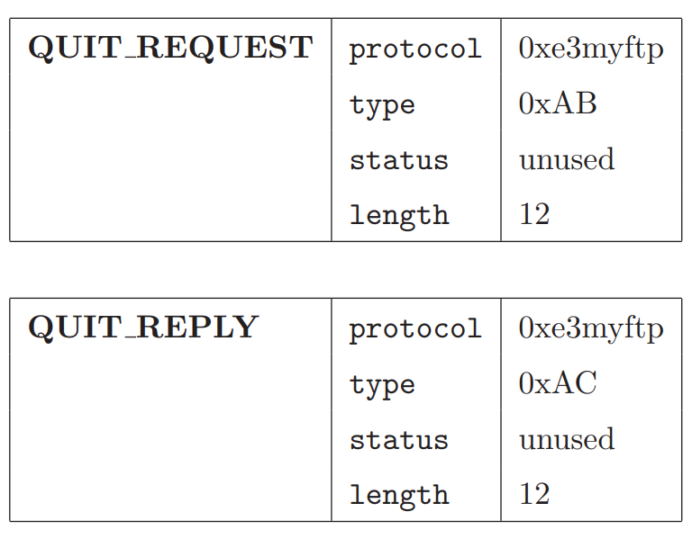

### 2.4 一个Client的Example

下图给出了一个执行Client的Example，你可以设计其他更炫的输出的Client，但是请注意，输入将从`STDIN`输入。

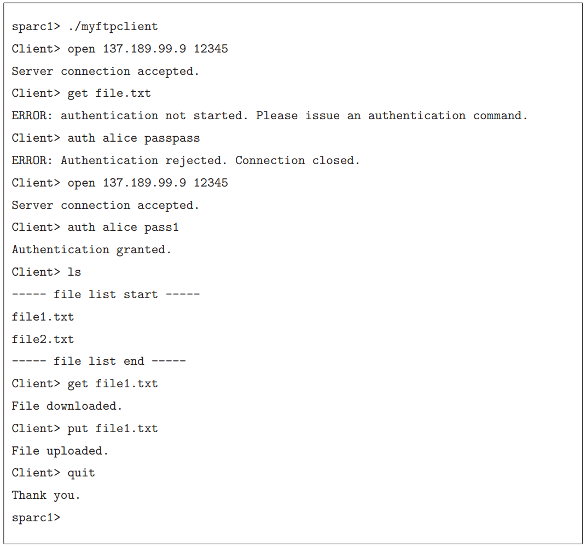

## 3. 如何进行本地测试

### 3.1 编译准备

我们已经提供了自动评测的程序，在接受Github Classroom邀请后每位同学有独立的Github仓库。

如果无法进行正常测试，请和助教联系

#### 3.1.1 获取仓库

1. 从远程仓库clone
2. 在根目录中执行`git submodule update --init`
3. 在根目录中执行`git submodule update --remote`
4. 在根目录中执行`mkdir build && cd build && cmake ..`

#### 3.1.2 编译测试程序

我们提供了本地化的测试程序，如果需要在本地进行测试，请进行如下步骤：

1. 在根目录中执行`cd test_local && mkdir build && cd build && cmake .. && make`, 这会编译自动测试程序
2. 将文件`test_local/ftp_client_std, test_local/ftp_server_std, test_local/build/ftp_test`拷贝到`build/`中即可, 该操作只有第一次或测试程序更新后需要执行

注意若自动测试程序发生更新则需要执行如下指令获取最新的测试程序（我们会在教学网和微信群进行通知）:

在根目录中执行`git submodule update --remote`，并重新执行上述步骤1，2即可

在执行完成该步骤后，期望会在build目录中有文件:

1. `ftp_client_std`: 标准Client程序，使用方法同上
2. `ftp_server_std`：标准Server程序，使用方法同上
3. `ftp_test`：测试程序，执行该程序进行本地测试，使用方法见"3. 如何进行本地测试"

### 3.2 编译

在根目录的`build`目录中执行`make`即可编译

在编译完成后`build`目录中应当新增加了:

1. `ftp_client`
2. `ftp_server`

### 3.3 本地测试

在build目录中执行`.\ftp_test`即可进行测试

要求:
1. Server可执行程序和Client可执行程序名称需要严格按照`ftp_server`和`ftp_client`命名 (在下发的模板中我们已经完成了这一段代码)你只需要将对应的源文件添加到CMake中对应的target上即可
2. 具体协议内容请参考技术规范一节实现,在进行某一项测试的时候,只有一侧会使用你的Server/Client,另一侧为标准程序,为了确保能够正常通信,我们希望你的代码能够和标准程序进行交互
3. 任何对提供的**二进制文件**的修改均被视为作弊行为, 一经发现该Lab将被记为0分

### 3.4 提交

在根目录中执行如下指令提交所有文件

``` bash
git add .
git commit -am "Update"
git push
```

DDL前最后一次提交视为最终版本

## 4. 分数计算

本次Lab总分120分

部分测试点在Deadline前放出，另一部分测试点会在Deadline后统一进行测试，但是我们会在数据点内容中详细描述所有测试点的数据的特点。

同学们可以通过将该仓库push到Github进行自动化测试（Deadline前只会看到满分为90分）。

以下的表格给出了每一个测试点对应的ID和内容，你可以通过`.\ftp_test --gtest_filter=ID`来只针对某个测试点执行测试

或者使用通配符如`.\ftp_test --gtest_filter=FTPServer.*`只针对Server进行测试

每一个测试点名由`${类别}.${测试点名称}`构成

如没有特殊说明,则每一个测试点同时只有一个Client

<table>
    <tr>
        <td>类别</td>
        <td>测试点名称</td>
        <td>测试内容</td>
        <td>分数占比</td>
        <td>是否Deadline前放出</td>
        <td>数据点内容</td>
    </tr>
    <tr>
        <td rowspan="9">FTPServer</td>
        <td>Open</td>
        <td>测试OPEN_REQUEST</td>
        <td>10</td>
        <td>是</td>
        <td>收到正确的OPEN_REQUEST请求</td>
    </tr>
    <tr>
        <td>Auth</td>
        <td>测试AUTH_REQUEST</td>
        <td>10</td>
        <td>是</td>
        <td>拒绝无权限的身份验证，通过有权限的身份验证</td>
    </tr>
    <tr>
        <td>Get</td>
        <td>测试GET_REQUEST</td>
        <td>10</td>
        <td>是</td>
        <td>获取大小为3bytes的，文件名长度不超过3bytess的文件，文件名和内容随机生成</td>
    </tr>
    <tr>
        <td>Put</td>
        <td>测试PUT_REQUEST</td>
        <td>10</td>
        <td>是</td>
        <td>上传大小为3bytes的，文件名长度不超过3bytes的文件，文件名和内容随机生成</td>
    </tr>
    <tr>
        <td>List</td>
        <td>测试LIST_REQUEST</td>
        <td>10</td>
        <td>是</td>
        <td>获取文件夹内所有的文件列表</td>
    </tr>
    <tr>
        <td>GetBig</td>
        <td>测试GET_REQUEST</td>
        <td>10</td>
        <td>否</td>
        <td>获取大小为1MB的，文件名为8bytes的文件，文件名和内容随机生成</td>
    </tr>
    <tr>
        <td>PutBig</td>
        <td>测试PUT_REQUEST</td>
        <td>10</td>
        <td>否</td>
        <td>上传大小为1MB的，文件名为8bytes的文件，文件名和内容随机生成</td>
    </tr>
    <tr>
        <td>MultiPut</td>
        <td>测试PUT_REQUEST</td>
        <td>0</td>
        <td>是</td>
        <td>4个Client同时执行FTPServer.Put</td>
    </tr>
    <tr>
        <td>MultiGet</td>
        <td>测试GET_REQUEST</td>
        <td>0</td>
        <td>是</td>
        <td>4个Client同时执行FTPServer.GET</td>
    </tr>
    <tr>
        <td rowspan="6">FTPClient</td>
        <td>Open</td>
        <td>测试OPEN_REQUEST</td>
        <td>10</td>
        <td>是</td>
        <td>成功和Server建立连接</td>
    </tr>
    <tr>
        <td>Auth</td>
        <td>测试AUTH_REQUEST</td>
        <td>10</td>
        <td>是</td>
        <td>发送正确的用户名通过验证，发送错误的用户名被拒绝</td>
    </tr>
    <tr>
        <td>Get</td>
        <td>测试GET_REQUEST</td>
        <td>10</td>
        <td>是</td>
        <td>获取大小为3bytes的，文件名长度不超过3bytes的文件，该文件名和内容随机生成</td>
    </tr>
    <tr>
        <td>Put</td>
        <td>测试PUT_REQUEST</td>
        <td>10</td>
        <td>是</td>
        <td>上传大小为3bytes的，文件名长度不超过3bytes的文件，该文件名和内容随机生成</td>
    </tr>
    <tr>
        <td>GetBig</td>
        <td>测试GET_REQUEST</td>
        <td>5</td>
        <td>否</td>
        <td>获取大小为1MB的，文件名为8bytes的文件，文件名和内容随机生成</td>
    </tr>
    <tr>
        <td>PutBig</td>
        <td>测试PUT_REQUEST</td>
        <td>5</td>
        <td>否</td>
        <td>上传大小为1MB的，文件名为8bytes的文件，文件名和内容随机生成</td>
    </tr>
</table>

其中一些测试点为多Client的测试, 并不计算分数(别卷,没有附加分 QwQ)

## 5. 其他问题

> 若出现无法使用`git submodule update --remote`指令, 则请检查根目录下`.gitmodules`文件是否如下图所示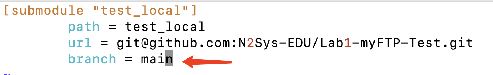

> 文件名无空格等特殊符号,仅包含数字和字母

> 若无法执行xxx_std则请通过`chmod +x xxx_std`为该文件增加可执行权限

> 同学们push的时候并不会将build目录push上去，可执行文件会在上传之后从代码自动生成，不需要做其他操作，无需考虑可执行权限问题
