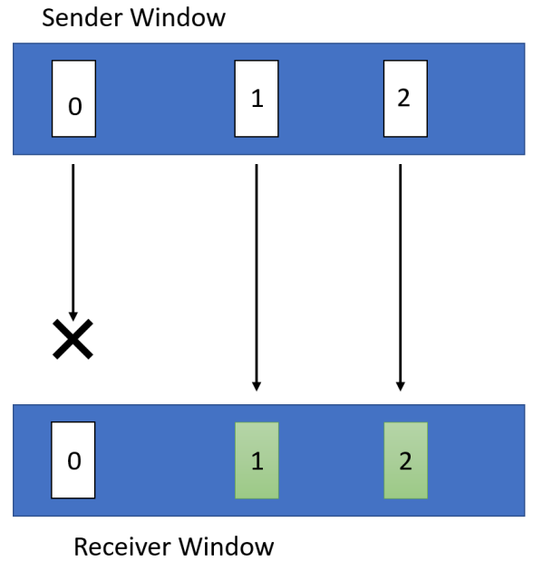
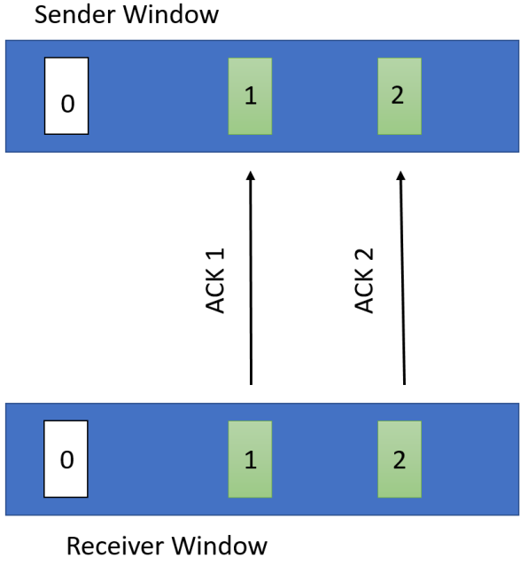
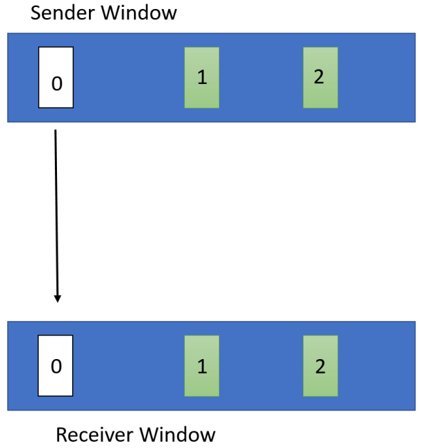
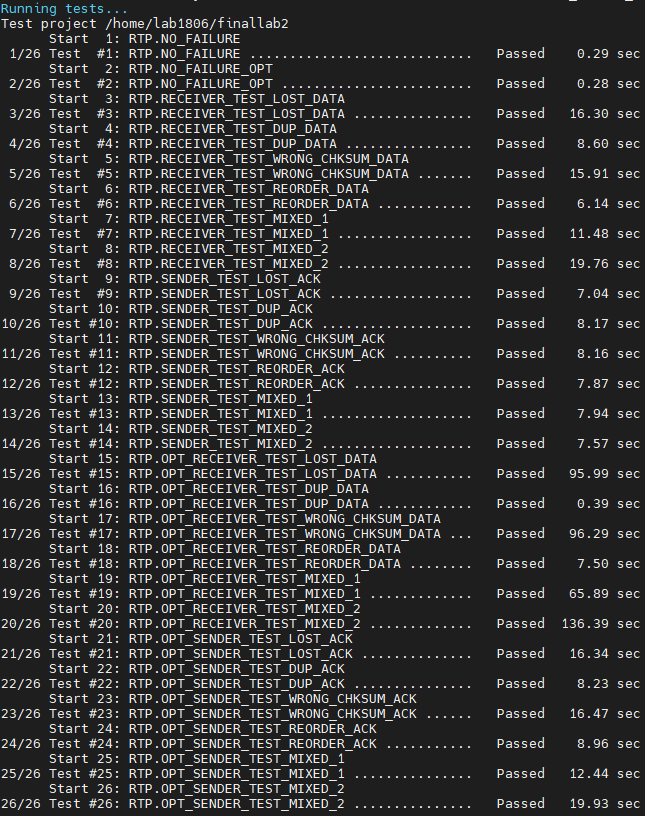

# RTP技术规范

## RTP头
每一个RTP报文包含一个在UDP包头后的RTP头，格式如下

``` cpp
typedef struct RTP_Header {
    uint8_t type;
    uint16_t length;
    uint32_t seq_num;
    uint32_t checksum;
} rtp_header_t;
```

为了简化操作，RTP头里的所有字段的字节序均是小端法

**type**: 标识了一个RTP报文的类型，0:`START`, 1:`END`, 2:`DATA`, 3:`ACK`

**length**: 标识了一个RTP报文**数据段**的长度（即RTP头后的报文长度），对于`START`,`END`,`ACK`类型的报文来说，长度为0

**seq_num**: 序列号，用于识别顺序做按序送达

**checksum**: 为RTP头以及RTP报文数据段基于32-bit CRC计算出的值，注意，计算checksum时checksum字段应被初始化为0


## 连接状态

**建立连接** `sender`首先发送一个type为`START`的，并且`seq_num`为随机值的报文，此后等待携带相同`seq_num`的`ACK`报文，`ACK`报文到达后即建立连接

**数据传输** 在完成连接的建立之后，要发送的数据由`DATA`类型的报文进行传输。发送方的数据报文的`seq_num`从0开始每个报文递增。注意，数据传输阶段使用的`seq_num`与建立连接时使用的`seq_num`没有联系

**终止连接** 在数据传输完毕后，发送方发送一个type为`END`的报文以终止连接。为了保证所有数据都传输完成，发送方的`END`报文的`seq_num`应当和下一个报文的`seq_num`相同，在接收到携带相同`seq_num`的`ACK`报文后即断开连接

## 其它

**报文大小** 在用户期望传输一段数据的时候，我们并不能直接将这段数据进行传输，一般在网络中IP报文的总长度不会超过1500Bytes(否则会被自动分段)，IP头长度一般为20bytes，UDP头长度为8bytes，因此你需要保证你的RTP报文总长度不会超过1472bytes(RTP头+数据)

<div STYLE="page-break-after: always;"></div>

# Part 1: 实现 `sender`

## 说明
`sender`应该读取输入消息，采用RTP协议，通过UDP套接字将其发送到指定的接收方。

`sender`需要将输入消息分割为适当大小的数据块，并为每个报文附加一个`checksum`。请使用我们在`src/util.c`中提供的32位CRC计算程序，以便向包中添加校验和。

连接中每增加一个报文，`seq_num`就增加1。

你将会使用滑动窗口的机制来实现可靠传输，窗口大小`window_size`将会作为一个初始化参数。该参数保证了当前正在传输，并且没有被`receiver`确认的报文数量没有超过`window_size`

`sender`在传输完整个消息后应该发送一个`END`报文以标记连接的终止。

`sender`要考虑在如下几种网络情况下的可靠传输:

* 在任意一层发生的丢包
* `ACK`报文的乱序到达
* 任意数量的任意报文多次接收
* `ACK`报文延迟
* 报文损坏

每一个`DATA`报文会被一个`ACK`报文所确认，为了处理`DATA`报文丢失或者`ACK`报文丢失的情况，你需要设置一个计时器以自动重传未被确认的`DATA`报文。

该计时器在滑动窗口移动时重置，当该计时器到达100ms的时候，需要将**当前窗口中的所有`DATA`报文**全部重新发送

## 实现要求

你应当在`sender_def.c`程序中实现以下三个函数，其均已在`sender_def.h`中被声明。

``` cpp
/**
 * @brief 用于建立RTP连接
 * @param receiver_ip receiver的IP地址
 * @param receiver_port receiver的端口
 * @param window_size window大小
 * @return -1表示连接失败，0表示连接成功
 **/
int initSender(const char* receiver_ip, uint16_t receiver_port, uint32_t window_size);

/**
 * @brief 用于发送数据
 * @param message 要发送的文件名
 * @return -1表示发送失败，0表示发送成功
 **/
int sendMessage(const char* message);

/**
 * @brief 用于断开RTP连接以及关闭UDP socket
 **/
void terminateSender();
```

> 实现这三个函数的目的是为了方便进行测试，测试程序会直接调用这三个函数，因此请注意不要使用错误的函数定义。注意，你不需要实现一个完整的`sender`，当然，为了能够单独执行你也可以使用这三个函数实现一个自己的`sender`的可执行程序，这并不复杂。

> 请不要在函数内部直接使用`exit`等导致**进程**退出的指令，这会导致评测程序也直接停止执行


<div STYLE="page-break-after: always;"></div>

# Part 2: 实现 `receiver`


## 说明

`receiver`必须能准确并且完整的收到及储存`sender`所发的信息，注意，只需要考虑只存在一个`sender`的情况

`receiver`需要计算CRC32的`checksum`，对于`checksum`不对的报文应当直接丢弃

对于每一个被确认接收的`START`报文或`END`报文，你需要发送一个`ACK`报文，该报文的`seq_num`已在`RTP技术规范`中描述

对于每一个被确认接收的`DATA`报文，你需要发送一个`ACK`报文，该报文的`seq_num`为当前期望收到的下一个`DATA`报文的`seq_num`

举例而言有如下两种情况(假设期望收到的下一个报文`seq_num为N`):

1. 如果当前报文`seq_num大于且不等于N`: 接收并缓存该报文，并发送一个`seq_num=N`的`ACK`。注意，这与课堂上讨论的Go-Back-N (GBN) 机制略有不同。GBN完全丢弃乱序包，而在这里接收器缓冲乱序包。这里的机制比GBN更有效。

2. 如果当前报文`seq_num等于N`: 发送一个`seq_num=M`的`ACK`，这里`M`为`seq_num`最小的还没有被缓存的报文，并将`M`前所有缓存的报文按序写入文件（包括最新收到的报文）

对于那些`seq_num >= N + window_size`的报文会被直接丢弃，以保证`receiver`窗口大小不超过`window_size`

## 实验要求

你应当在`receiver_def.c`程序中实现以下三个函数，其均已在`receiver_def.h`中被声明。

``` cpp
/**
 * @brief 开启receiver并在所有IP的port端口监听等待连接
 * 
 * @param port receiver监听的port
 * @param window_size window大小
 * @return -1表示连接失败，0表示连接成功
 */
int initReceiver(uint16_t port, uint32_t window_size);

/**
 * @brief 用于接收数据并在接收完后断开RTP连接
 * @param filename 用于接收数据的文件名
 * @return >0表示接收完成后到数据的字节数 -1表示出现其他错误
 */
int recvMessage(char* filename);

/**
 * @brief 用于接收数据失败时断开RTP连接以及关闭UDP socket
 */
void terminateReceiver();
```

> 实现这三个函数的目的是为了方便进行测试，测试程序会直接调用这三个函数，因此请注意不要使用错误的函数定义。注意，你不需要实现一个完整的`receiver`，当然，为了能够单独执行你也可以使用这三个函数实现一个自己的`receiver`的可执行程序，这并不复杂

> 请不要在函数内部直接使用`exit`等导致**进程**退出的指令，这会导致评测程序也直接停止执行

<div STYLE="page-break-after: always;"></div>

# Part 3: 实现 `opt_sender` and `opt_receiver`

## 说明

在这部分中，你们将对前两部分所写的程序做一些修改。考虑在前面的部分中编写的程序对于下图中窗口大小为3的以下情况将如何表现:



在这种情况下，接收方将返回两个`seq_num`为0的`ACK`报文。这将导致发送方超时并重传`DATA`报文0、1和2。然而，由于接收器已经接收和缓存`DATA`报文1和2，这重传两个报文是不必要的。

为了应对这种情况，你需要相应地修改你的`receiver`和`sender`:

* `receiver`不再发送累计的`ACK`报文，即，对每一个收到的`DATA`报文，`receiver`不再发送携带期望收到的下一个`DATA`报文的`seq_num`的`ACK`报文，而是发送一个携带与收到的`DATA`报文有着相同`seq_num`的`ACK`报文

* `receiver`仍然维护一个`N`表示期望的下一个`DATA`报文的`seq_num`，对于携带任意大于或等于`N+window_size`的`seq_num`的`DATA`报文应当直接丢弃

* `sender`需要维护当前窗口中所有收到的`ACK`报文，并在超时后仅重传那些没有被ACK的`DATA`报文

优化后，在之前的例子中，如下图所示，优化后的`sender`会等待到超时，然后仅重传窗口中`DATA`报文0





## 实现要求

你应当在`sender_def.c`和`receiver_def.c`中应当实现以下函数，**注意该函数需要兼容之前写的`initSender,initReceiver`以及`terminateSender,terminateReceiver`函数**

``` cpp

/**
 * @brief 用于发送数据(优化版本的RTP)
 * @param message 要发送的文件名
 * @return -1表示发送失败，0表示发送成功
 **/
int sendMessageOpt(const char* message);

/**
 * @brief 用于接收数据并在接收完后断开RTP连接(优化版本的RTP)
 * @param filename 用于接收数据的文件名
 * @return >0表示接收完成后到数据的字节数 -1表示出现其他错误
 */
int recvMessageOpt(char* filename);
```

> 实现这两个函数的目的是为了方便进行测试，测试程序会直接调用这两个函数，因此请注意不要使用错误的函数定义。为了能够单独执行你也可以使用这三个函数实现一个自己的`opt_sender,opt_receiver`的可执行程序，这并不复杂。

> 请不要在函数内部直接使用`exit`等导致**进程**退出的指令，这会导致评测程序也直接停止执行

<div STYLE="page-break-after: always;"></div>

# Testing

## 说明

所有测试文件名长度均不超过100个字符，仅包含`a-z`26个字母。

传输的数据大小不超过`100MB`，其字符集合为char类型的中任意字符的并集

`sender`和`receiver`的窗口大小相同，且不超过`512`

所有测试点均只有一对一的`sender`以及`receiver`

测试用的`sender`会有以下四类传输故障：1) 丢失`DATA`报文, 2) `DATA`报文乱序, 3) `DATA`报文重复, 4) `DATA`报文checksum错误

测试用`receiver`会有以下四类传输故障：1) 丢失`ACK`报文, 2) `ACK`报文乱序, 3) `ACK`报文重复, 4) `ACK`报文checksum错误

Deadline前共有26个测试点，其中有2个测试点无传输故障，分别测试原始版本的RTP协议实现和优化版本的RTP协议实现。

其余24个测试点分为4组6个，分别测试优化/非优化版本的`sender`/`receiver`。对于每组故障，6个测试点分别为单独的1-4类传输故障，少量1-4类传输故障任意混合，以及大量1-4类传输故障任意混合。注意，1）任何一类故障均可重复出现，2）由于窗口大小设置，这24个测试点均有可能发生自然的报文丢失故障，前两个无传输故障测试点不受影响。

Deadline后新增10个测试点，包含更大窗口，更大数据，以及更高故障概率的测试，但均遵守以上说明

每个测试点分数相同

## 代码

提供的源代码主要包含以下部分：

1) `third_party`文件夹为googletest源代码，不需要修改
2) `CMakeLists.txt`为一个可用的CMake模板，实现`sender_def.c`, `receiver_def.c`, `rtp.c（我用于定义一些所需函数的代码）`后执行`cmake .`以及`make`即可编译全部代码。`rtp.c`不是必须的，你可以根据实际情况选择性使用这些文件，你也可以修改`CMakeList.txt`以满足自己特定的需求。
3) `src`文件夹下为各函数定义的头文件，以及RTP的包头格式。

## 测试

编译全部代码后执行`make test CTEST_OUTPUT_ON_FAILURE=TRUE GTEST_COLOR=TRUE`即可进行本地测试，每个测试点分数相同。

若想测试单独的测试点，可调用./rtp_test_all --gtest_filter=`测试点名`，例如`./rtp_test_all --gtest_filter=RTP.OPT_RECEIVER_TEST_LOST_DATA`

关于每个测试点具体调用的测试文件，请参见test.cpp源码

下图为一次成功测试的样例



<div STYLE="page-break-after: always;"></div>

需要修改测试文件，去https://github.com/N2Sys-EDU/Lab2-RTP-Test 仓库下载所有以test为前缀的可执行文件

# 特殊情况处理

在实际完成该协议的过程中，因为不是完整的可靠面向连接协议，还有很多BUG，为此补充了一些特殊情况下的处理

> 这也是为什么TCP需要三次握手，四次挥手，我们希望大家在完成这个Lab的过程中能自己想清楚这一点

## `sender`

1. 对于`START`类型的`ACK`报文丢失，当`sender`判定超时后，此时`receiver`已经建立连接，并准备接收数据，此时直接向`receiver`发送`END`报文
2. `sender`判断`START`的`ACK`报文损坏后，直接向`receiver`发送`END`报文
3. 对于`END`类型的`ACK`报文丢失，`sender`判断超时后，直接结束

## `receiver`

1. 设置一个超时时间(建议为10s)当超过这个时间没有收到任何报文的时候，即认为该连接已经关闭
2. 当`START`报文的`checksum`错误，`receiver`进程直接退出即可
