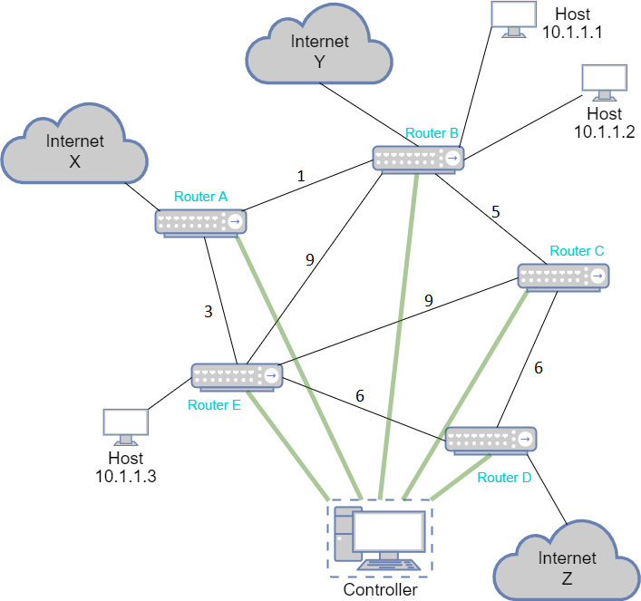

# Lab3

在 Lab 3 中，你需要实现一个简单的运行 DV 算法并支持 NAT 功能的路由器。

具体地，你需要将你的路由器实现为 C++ 类，我们将提供一个**单进程**模拟器用于测试。模拟器将会创建多个你实现的类对象，构成一个模拟的网络拓扑，并**通过调用类成员函数的方式模拟各个路由器接收，转发，发送报文的过程**（这就意味着，本次 Lab 你不需要通过 socket 进行实际数据收发）。

## 1. 网络结构

在 Lab 3 中，我们考虑一个数据中心网络，图的拓扑结构可以是任意的，下图给出了一个网络的例子



本次 Lab 中，为了简化实现，我们对网络拓扑做出如下约定：

1. 我们将不关注路由器各个端口的 IP 地址。
2. 每个路由器只能有最多一个与外网连接的端口，其他端口均为内网端口（与路由器或 host 连接的端口）。（如图中路由器 A 连向外网 X，路由器 B 连向外网 Y，路由器 D 连向外网 Z，路由器 C, E 与外网没有直接连接）。
3. 每台 host 均有唯一的内网 IP 地址且只能连接一台路由器。
4. 每台路由器上可以有多个与其相连的 host。
5. 网络中存在一个用于 Lab 测试的 Controller 节点（该节点将由模拟器提供，不需要同学们实现），它与每台路由器均相连。 

在这个网络中，我们仅考虑路由器之间的连接权值。路由器之间的连接权值可以是任意**正整数**。路由器与 Host 之间，路由器与 Controller 之间及外网端口的权值均设为 0。 

**我们规定在 Lab 3 中的数据中心内所有 host 的 IP 地址都属于网络 10.0.0.0/8, 这个范围外的所有 IP 地址均为外网地址**。

注意，我们将使用模拟器模拟该网络环境进行测试，而非在真实环境中进行测试。

## 2. 功能要求

这一节将描述你需要实现的路由器功能。

你实现的路由器类将用于创建模拟器中的多个路由器实例（即所有路由器的实现都是一致的）。总的来说，路由器需要在接收到一个报文后，根据目的地址决定转发到哪一个端口。另外路由器还需要实现网络地址转换 (NAT) 以支持内网地址和公网地址之间的相互转换。

### 2.1. 路由算法

我们希望你的路由器程序使用距离矢量算法，因为之后的接口设计将基于这一假设。你的路由器应当能够通过不断地信息交换最终得到到达任意可达 host 的最短路径，特别地，你也应该能够得出到达任意可达外网地址（需经 NAT 转换）的最短路径。

路由器在收到数据报文时应当按照计算得到的最短路径进行转发。若有多条最短路径，你可以任意选择一条路径。

我们在这里列出 Lab 3 测试时将会检查的内容：

1. 转发功能，即路由器能否正确转发报文。
2. 可达性，即连通的情况下，从 host A 发出的报文能否正确到达 host B 。
3. 最优路径，即在 1 满足的前提下，**路由路径的长度是否等于最短路径长度**，我们将不会检查具体的转发路径。
4. 动态路由，即在网络拓扑变化（包括添加或删除路由器之间的边，修改路由器之间的边权，添加或删除 host ）的情况下能否正确计算得到最优路径。

你可以自由设计 DV 算法的实现方式，我们将不会检查路由器上的距离向量表以及路由器间传输 DV 信息的报文。 

### 2.2. NAT

对于存在外网端口的路由器，它需要支持最基础的 NAT 功能。在 Lab 3 中，为了简单起见， NAT 的工作方式与课堂上存在差别：我们将直接基于 IP 地址进行映射，即将内网 IP 直接映射为一个外网 IP ，而不基于 IP:port 进行映射。

因此， Lab 3 中的 NAT 功能包括：

1. 每个路由器最多拥有 256 个可用公网地址用于 IP 映射。每个路由器的可用公网地址不重合。
2. 每个路由器支持最多一个外网端口。
3. 对于来自内网端口的报文，若下一跳将从外网端口发出，需要执行网络地址转换。即若该报文源地址尚未分配公网地址，则需要为该源地址分配一个可用公网地址，并将报文中的源地址替换为对应公网地址后再发出。若没有空闲的可用公网地址，则丢弃该报文。若已分配地址，则直接将源地址转换为对应公网地址后发出。
4. 对于来自外网端口的报文，若其目的地址不是该路由器在 2 中已分配的公网地址，则直接丢弃。否则将目的地址转换为对应的内网地址后再进行路由转发。

**我们假设路由器的外网地址范围中的 ip 都是可达的，请注意处理从内网访问外网的报文**。

对于 NAT ，我们将检查

1. 是否满足上述 4 条功能要求。
2. 动态地址分配是否正确（你可以任意设置地址的分配方式，我们将检查经过转换后的地址是否属于该路由器的可用公网地址，该地址是否已经被占用）。

你可以自由选择 NAT 的实现方式，在本 Lab 中，你只应该在收到来自 Controller 的 `RELEASE NAT ITEM` 报文时释放可用公网地址（即当一个内网地址和公网地址之间的映射建立后，它必须保持不变直到接收到 Controller 的释放报文），我们将在 3. 中描述 Controller 的控制报文。


### 2.3. Controller

Controller 用于通知路由器网络环境的变化或要求路由器发送距离向量，它通过发送控制报文来实现这一功能。

**你不需要实现 Controller**，但为了进行测试，你实现的路由器类需要能够处理来自 Controller 的控制报文，并作出相应的操作。 Controller 的报文将和其他报文一样通过 Simulator 以调用类成员函数的方式传递给路由器。

我们将在 3. 中具体描述控制报文的内容，并在 4. 中详细描述 Simulator 的调用方式以及数据报文的传递方式。

### 2.4. Simulator

**你同样不需要实现 Simulator**, 但为了 Simulator 能够正常进行模拟测试，你需要遵循 Simulator 规定的路由器类接口。我们将在 4. 中描述这一内容。

## 3. 技术规范

### 3.1. 报文格式

在 Lab 3 中，每一个报文都由 报头 + payload 的方式组成，每个报文仅包含一个报头， payload 的内容由报头中的 `type` 字段决定。

报头的格式如下：

```cpp
struct {
    uint32_t    src;
    uint32_t    dst;
    uint8_t     type;
    uint16_t    length;
};
```

> 注意，这里利用了结构体对齐规则使报头最终四字节对齐，你可以认为在 `type` 字段之后存在一字节的保留字段。我们建议你直接使用上述结构体。

`src` 和 `dst` 字段分别表示源和目的 IPv4 地址。

`length` 字段为报头后的 payload 长度。

`type` 字段有三个取值，分别为 `TYPE_DV` , `TYPE_DATA` 和 `TYPE_CONTROL` 。其值分别为

```cpp
uint8_t TYPE_DV         = 0x00;
uint8_t TYPE_DATA       = 0x01;
uint8_t TYPE_CONTROL    = 0x02;
```

对于 `TYPE_DATA` ，其后的 payload 仅包含 host 之间需要传输的数据。路由器应当转发该种报文，并且保持 payload 不变，**测试时将会检查 payload 的正确性** 。

对于 `TYPE_DV` ，该种报文用于允许在路由器之间交换距离向量，你可以自己定义其后的 payload 格式和内容。另外，路由器收到该类型报文时的行为也是自定义的，测试时将不会检查该类型报文的内容。

对于 `TYPE_CONTROL` ，该种报文仅由 Controller 发出，其 payload 包含一条指令**字符串** ，我们将在 3.2. 中阐明其内容。

**注意，`src` 与 `dst` 字段为大端法表示，其余字段均为小端法表示**。

**注意，单个报文的长度不应该超过 16384 字节（报头+payload）**。

### 3.2. 控制指令

控制指令是包含在 CONTROL 报文中的**字符串**。

每条控制指令形如 `<type> <param> ...` ，其中 `<type>` 为非负整数，用于指示该条指令的类型。 `<param>` 由具体的指令类型确定。我们将在每个指令类型的描述中给出具体的例子。

你的路由器需要支持的控制指令如下：

| command           | `<type>` |
| ----------------- | -------- |
| TRIGGER DV SEND   | 0        |
| RELEASE NAT ITEM  | 1        |
| PORT VALUE CHANGE | 2        |
| ADD HOST          | 3        |

注意该表给出了每个类型对应的 `<type>` 字段的值。所有的控制指令均以 `<type>` 字段作为首个字段。

#### 3.2.1. TRIGGER DV SEND

该指令仅包含 `<type>` ，例如一条该指令将形如 `0`。路由器应当在收到该指令后主动发起一次距离向量交换。 注意，该指令同样通过类函数调用以报文的形式传递给路由器。路由器最多返回一条报文，该报文的内容应该等同于路由器收到 `TYPE_DV` 报文后触发更新时发送的报文内容。

> 该指令用于代替一般 DV 算法中需要每隔一定时间向邻居发送自己的距离向量的操作。即通过 Controller 发送指令的方式代替每个路由器上的计时器。

#### 3.2.2. RELEASE NAT ITEM

该指令格式为 `<type> <internal_ip>` ，其中 `<internal_ip>` 为一个点分十进制表示的内网 IPv4 地址，一条合法的指令例如 `1 10.0.0.0` 。路由器在收到该指令后，应当将 `<internal_ip>` 拥有的已分配公网地址释放，该内网地址不再拥有公网地址直到再次被分配。

#### 3.2.3. PORT VALUE CHANGE

该指令格式为 `<type> <port> <value>` ，其中 `<port>` 为大于 1 的整数, `<value>` 为**正整数或 -1**，一条合法的指令例如 `2 5 6` 。该条指令意为将路由器的 `<port>` 端口对应的链路权值更新为 `<value>` （保证该指令对称出现，即会同时向链路两端的路由器发送指令）。路由器在收到该指令后，应当更新端口所对应链路的权值。

**我们约定端口号从 1 开始编号。特别地，每个路由器的 1 号端口均与 Controller 连接。**

**特别的， `<value>` 为 `-1` 时意为该端口被关闭**。

**保证当 `<port>` 连接 host 时， `<value>` 仅可能为 -1**

#### 3.2.4. ADD HOST

该指令格式为 `<type> <port> <ip>` ，其中 `<port>` 为正整数值， `ip` 为一个点分十进制表示的地址，一条合法的指令例如 `3 2 10.0.0.10` 。该条指令通知路由器在 `<port>` 端口上连接了一台 IPv4 地址为 `<ip>` 的 host 。路由器收到该指令后应该更新路由。

## 4. 实现要求

### 4.1. 路由器接口

为了避免多进程引入的不确定性以方便调试和测试，我们要求你必须按照给定的类接口实现你的路由器程序。

具体来讲，在下发文件的 `router_prototype.h` 中定义了抽象类 `RouterBase` 

```cpp
class RouterBase {
public:
    virtual void router_init(int port_num, int external_port, char* external_addr, char* available_addr) = 0;
    virtual int router(int in_port, char* packet) = 0;
};
```

**你实现的 router 必须继承该抽象类并实现上述两个纯虚函数**。

#### 4.1.1. `router_init`

`router_init` 函数用于初始化路由器状态，其包含四个参数

+ `port_num` 表示该路由器的端口数，保证 `port_num` 大于 `0` 
+ `external_port` 表示该路由器的外网端口号，若 `external_port = 0` 则表示该路由器没有连接外网
+ `external_addr` 表示该路由器所连接的外网的地址范围，其使用 CIDR 进行表示，例如 `177.0.0.0/24` 表示的地址范围为 `177.0.0.0` 到 `177.0.0.255` 。若 `external_port = 0` 该参数为空指针
+ `available_addr` 表示该路由器的可用公网地址范围，表示方式同 `external_addr` 。若 `external_port = 0` 该参数为空指针

简单起见，我们约定 `external_addr` 和 `available_addr` 最多包含 256 个地址，我们不考虑保留地址与广播地址，因此 `0` 与 `255` 也是可用地址。

**注意，我们约定端口号从 1 开始编号。特别地，每个路由器的 1 号端口均与 Controller 连接。**

**保证所有路由器的外网端口地址范围不重合，所有路由器的可用公网地址不重合**。

在初始化时，路由器仅有 **1** 号端口和外网端口处于开启状态。

**注意，当 `external_port = 0` 时， `external_addr` 与 `available_addr` 为空指针**

#### 4.1.2. `router`

`router` 函数规定了路由器接收并转发报文的接口，其包含两个参数

+ `in_port` 表示收到的报文的入端口号
+ `packet` 表示收到的报文，其满足 3.1 中的报文格式

该函数接收一个报文，处理后最多返回一个报文，返回的报文仍然保存在 `packet` 中。

函数的返回值表示返回的报文应该转发到的端口号，特别地

+ 返回值为 `0` 表示该报文应当被广播到所有相邻路由器
+ 返回值为 `-1` 表示路由器丢弃了报文，因而没有返回报文
+ 返回值为 `1` 表示将报文转发给默认网关，**我们用 Controller 充当默认网关，当路由器中没有目标地址的路由时，应当将数据报文转发到默认网关**

**注意，不要在 `router()` 中释放 `packet`**

另外，每个报文的总长度 (header + payload) 不应该超过 16384 字节，我们使用了较大的报文长度以确保你不需要使用多个报文来发送距离向量，数据范围请参见 6.。如果这个限制仍然太小，那么你应该考虑更改实现方式。

> 注意，在 Lab 3 中，我们规定的接口仅给出了入端口号，而没有给出链路另一端对应的路由器，这在某些情况下可能导致路由环路，但由于我们规定了链路权值是正的，因此不会产生环路。

### 4.2. 模拟器工作流程

你应该继承类 `RouterBase` ，并在你的类中以自己喜欢的方式实现 `router_init()` 和 `router()` 。下面我们将介绍模拟器的工作流程，在实现你的路由器类时，你需要考虑模拟器对你的路由器类的调用方式。

Sumulator 在测试时将基于如下逻辑运行：

``` cpp
test()
{
    1. simulator creates controller
    2. simulator craetes router objects by calling create_router_object() multiple times and calls router_init() of each router object
    3. controller receives commands from tester and generates control packets to modify network topology
    4. simulator sends packets in 3. to routers and forwards returned packet by router() function call until no packet is forwarding or packet forwarded too many times
    5. tester generates some data packets
    6. simulator traces data packet forwarding 
    7. tester check if data packets is correctly forwarded and jump to 3. if test is not finished
}
```

在第 1, 2 步中， Simulator 通过创建一个 Controller 实例和多个 router 实例来模拟实机环境。为了使 Simulator 能够创建你定义的 router 类，我们在 `router_prototype.h` 中声明了一个辅助函数

```cpp
RouterBase* create_router_object();
```

**你应该实现该函数使其创建一个你定义的 router 类对象并返回其指针**。例如

```cpp
RouterBase* create_router_object() {
    return new Router;
}
```

在第 3 步中，测试程序（或测试者）将向 Controller 发送测试相关的命令， Controller 将根据收到的命令生成对应的控制报文来定义或修改网络拓扑。

**注意，所有网络拓扑结构将完全通过 control packet 进行定义与修改。**

**测试程序保证在第 3 步中 Controller 生成的最后若干条控制报文是发往所有路由器的 `TRIGGER DV SEND` 报文，用于强制路由器开始若干次距离向量交换。这里的若干条指 Controller 会持续生成 `TRIGGER DV SEND` 直到某一轮（一轮指一条发往所有路由器的报文被所有路由器处理完成）中所有路由器收到 DV 报文后均没有触发更新（生成新的 DV 报文）。对于实现正确的 DV 算法，这足以保证在第 6 步开始前 DV 算法收敛到最优值**。

> 在上述的过程中， Controller 会通过 Router 的转发行为判断是否触发更新，请保证 Router 在未触发更新时丢弃而不发送报文。

在第 4 步中， Simulator 会将 Controller 生成的控制报文发送给路由器，并将路由器返回的报文传递给对应的接收者。 Simulator 将会重复这一过程直到网络中不存在报文传输，或是报文的转发次数超过了设定的阈值。

一般情况下，你的路由器应当采用 DV 算法因此并不需要关心 `router()` 函数被调用的顺序，但你可以认为 Simulator 中对 `router()` 的调用具有如下顺序

``` cpp
while(1) {
    for(i = 1; i <= n; i ++) {
       # call router() of router i once if any packet in it's ingress queue
       # forward the output to ingress queue of corresponding routers  
    }     
}
```

**我们将 Simulator 允许的转发次数设定为了一个足够大的数值，我们认为一个正确实现的 DV 算法不会超过该限制。**

在第 5-7 步中，测试程序将生成一些数据报文并由 Simulator 发送给路由器， Simulator 将会追踪数据报文的转发路径并报告给测试程序，最后由测试程序判定报文是否被正确转发。


### 4.3. 测试要求

> 相信你一定发现了 Lab 3 存在漏洞，我们并不阻止你利用漏洞，**一切均以最终测试分数为准**。

> 但请注意，**任何修改 Controller 或 Simulator 的行为将被视为违规，本次 Lab 记 0 分**。

测试将主要分为三个部分，分别检查路由算法和 NAT 的功能实现是否正确，以及路由算法与 NAT 同时运行时是否正确。对于每一个测试点，你必须通过该测试点中的所有测试才能获得该测试点的分数。

## 5. 本地运行与测试

我们提供了自动测试的程序，在接受 Github Classroom 邀请后每位同学有独立的 Github 仓库。

如果无法正常进行测试，请和助教联系。

### 5.1. 获取仓库

1. 从远程仓库 clone 
2. 在根目录中执行 `git submodule update --init`
3. 在根目录中执行 `git submodule update --remote`
4. 在根目录中执行 `mkdir build`

### 5.2. 编译测试程序

我们提供了本地测试程序，如果需要在本地进行测试，请进行如下步骤：

1. 在根目录中执行 `cd test_local && mkdir build && cd build && cmake .. && make` ，这将编译本地测试程序
2. 将文件 `test_local/build/lab3_test` 拷贝到 `build/` 中，该操作只需在第一次获取测试程序或测试程序更新后执行

注意，若测试程序发生更新，请执行如下指令获取最新的测试程序（我们会在教学网和微信群进行通知）：

在根目录中执行 `git submodule update --remote` 并重新执行上述步骤 1，2 

### 5.3. 编译你的程序

我们在模板仓库中下发了 CMake 模板，你可以修改 `CMakeList.txt` 以新增源文件。

**注意，在 `test_local` 目录下应该有下发静态库 `libsimulator.a` ，在编译前你需要将该文件拷贝到根目录的 `build/` 目录中**。

若 libsimulator 发生更新，你需要在根目录中执行 `git submodule update --remote` 后重新将其拷贝到 `build/` 中。

我们将 `router.cpp` 也编译成静态库，并将 `libsimulator.a` 与 `librouter.a` 链接到 `simulator` 以生成完整的模拟器可执行程序。 
你可以通过在根目录的 `build` 目录中执行 `cmake.. && make` 命令，在本地编译生成 `simulator` 来运行并测试你的路由器。

请不要修改下发文件中的 `simulator.cpp` 并保证链接时 `libsimulator` 位于 `librouter` 之前。否则将无法正常测试。

### 5.4. debug mode

为了便于调试，我们为 `simulator` 提供了 debug 模式。

你可以通过执行 `./simulator 0` 来运行 debug 模式。在该模式下，你可以认为 `simulator` 提供了一个运行 `controller` 与 `router` 的模拟器，你可以通过以下指令进行调试

> **注意，下述指令中 2-7 发送的报文仅发送到路由器的输入队列，而没有调用 `router()` ，只有当执行 8/9 时才会调用 `router()` 。而 10/11 则会立即调用 `router()` 并递归跟踪转发路径**。

1. `new <port_num> <external_port> <external_addr> <available_addr>` 创建一个新的路由器，参数与 `router_init()` 的参数一致， `simulator` 将会返回创建的路由器的编号（正整数） 。该指令将会创建 router 实例并调用 `router_init()` 。注意，当 `external_port = 0` 时，你仍然需要再输入两个任意字符串，例如 `new 2 0 0 0`
2. `link <router_id> <router_id> <weight>` 连接由 1 中返回的路由器编号指定的两个路由器，链路权值必须为**正整数**，端口号将由 controller 选择。该指令将会向两个路由器分别发送一条 `CHANGE PORT WEIGHT` 报文
3. `cut <router_id> <router_id>` 断开两个路由器之间的连接。该指令将会向两个路由器分别发送一条 `<value>` 为 -1 的 `CHANGE PORT WEIGHT` 报文 
4. `weight <router_id> <router_id> <weight>` 修改两个路由器之间的链路权值，链路权值必须为**正整数**。该指令将会向两个路由器分别发送一条 `CHANGE PORT WEIGHT` 报文
5. `addhost <router_id> <addr>` 在对应路由器上连接一台 host ，其 ip 地址为 `<addr>` 。该指令将会向路由器发送一条 `ADD HOST` 报文
6. `delhost <addr>` 删除地址为 `<addr>` 的 host 。该指令会向对应路由器发送一条 `<value>` 为 -1 的 `CHANGE PORT WEIGHT` 报文
7. `release <router_id> <addr>` 表示释放对应路由器上内网 ip 为 `<addr>` 的 NAT 表项
8. `trigger` 向所有路由器发送一条 `TRIGGER DV SEND` 报文
9. `n` 使所有路由器从其对应的输入队列获取一个包并执行一次转发
10. `ns` 不断执行 8 直到网络中不再有报文转发
11. `hostsend <src_addr> <dst_addr> <payload>` 从 host `<src_addr>` 发送一条目的地址为 `<dst_addr>` 的数据报文， `<payload>` 为可选字段。`simulator` 将会返回路径长度与最后一跳报文的 src, dst, payload 
12. `extersend <router_id> <src_addr> <dst_addr> <payload>` 从路由器的外网端口发送一条数据报文，源地址必须为外网地址， `<payload>` 为可选字段。`simulator` 将会返回路径长度与最后一跳报文的 src, dst, payload 
13. `exit` 退出程序

一个运行时的例子可以参考

``` txt
new 4 2 102.0.0.0/24 117.117.117.0/24
new 3 0 0 0
link 1 2 5
addhost 1 10.0.0.0
addhost 2 10.0.0.1
trigger
ns
hostsend 10.0.0.0 10.0.0.1 Hello
hostsend 10.0.0.0 102.0.0.0 Hi
extersend 1 102.0.0.0 117.117.117.0 Hello
```

### 5.5. 本地测试

你可以通过执行 `./lab3_test` 来运行本地测试。

> 注意，请不要修改生成的可执行文件名 (simulator) 

你可以通过参数指定特定测试点进行测试，使用方式与 Lab 1 一致。

我们保证所有的 `host` 均具有合法且唯一的内网地址，所有路由器的外网端口地址和可用公网地址不重合。

## 6. 分数计算

本次Lab总分 110 分

部分测试点在 Deadline 前放出，全部测试点会在 Deadline 后统一进行测试。我们会在数据点内容中详细描述所有测试点的测试内容。

同学们可以通过 Github 进行自动化测试（Deadline 前只会看到满分为 90 分）。

### 6.1. 数据点

每一个测试点名由 `${类别}.${测试点名称}` 构成

> 注意，数据点中无修改操作是指：在最初设置好网络中的路由器， host 与他们之间的连接后，不会修改边权，加边，删边。测试程序通过 5.4. 中的指令进行测试，因此你可以认为所有 10/11 指令均在 1-6 指令之后。

所有数据点保证路由器数量不超过 100 个， host 数量不超过 300 个，所有路由器的可用公网地址数量之和不超过 1024 个，所有路由器的公网地址数量之和不超过 1024 个。 保证 `hostsend` 与 `extersend` 总共不超过 2000 条，保证所有的修改指令不超过 2000 条。

**单个测试点时间限制为一分钟**

> **数据保证不会通过删边操作使图不连通**。另外，你可以认为测试程序中不包含 delhost 。

<table>
    <tr>
        <td>类别</td>
        <td>测试点名称</td>
        <td>分数占比</td>
        <td>ddl 前放出</td>
        <td>数据点内容</td>
    </tr>
    <tr>
        <td rowspan="6">Routing</td>
        <td>Forward</td>
        <td>10</td>
        <td>是</td>
        <td>单个路由器上的转发</td>
    </tr>
    <tr>
        <td>Accessibility</td>
        <td>10</td>
        <td>是</td>
        <td>无修改，测试路由算法能否正确计算连通性</td>
    </tr>
    <tr>
        <td>StaticOptimal</td>
        <td>10</td>
        <td>是</td>
        <td>无修改，测试路由算法是否得到最短路</td>
    </tr>
    <tr>
        <td>DynamicOptimalAdd</td>
        <td>10</td>
        <td>是</td>
        <td>仅有加边操作，测试路由算法是否得到最短路</td>
    </tr>
    <tr>
        <td>DynamicOptimalDel</td>
        <td>10</td>
        <td>是</td>
        <td>仅有删边操作，测试路由算法是否得到最短路</td>
    </tr>
    <tr>
        <td>DynamicOptimalMix</td>
        <td>10</td>
        <td>是</td>
        <td>所有修改均存在，测试路由算法是否得到最短路</td>
    </tr>
    <tr>
        <td rowspan="2">NAT</td>
        <td>Basic</td>
        <td>10</td>
        <td>是</td>
        <td>单路由器，不含 release 命令，测试 NAT 功能</td>
    </tr>
    <tr>
        <td>Dynamic</td>
        <td>10</td>
        <td>是</td>
        <td>单路由器，含 release 命令，测试 NAT 功能</td>
    </tr>
    <tr>
        <td rowspan="3">General</td>
        <td>Static</td>
        <td>10</td>
        <td>是</td>
        <td>多路由器，同时测试 NAT 与路由算法，不含修改操作</td>
    </tr>
    <tr>
        <td>Dynamic1</td>
        <td>10</td>
        <td>否</td>
        <td>无特殊限制</td>
    </tr>
    <tr>
        <td>Dynamic2</td>
        <td>10</td>
        <td>否</td>
        <td>无特殊限制</td>
    </tr>
</table>

