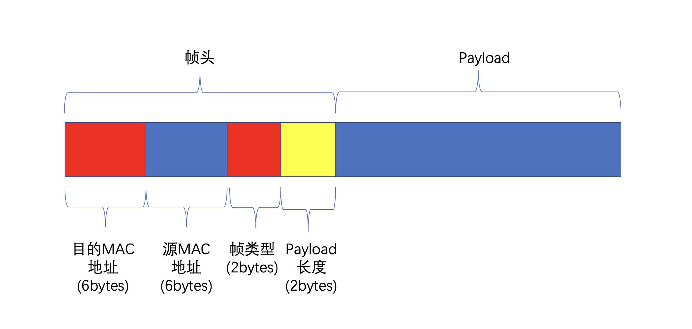
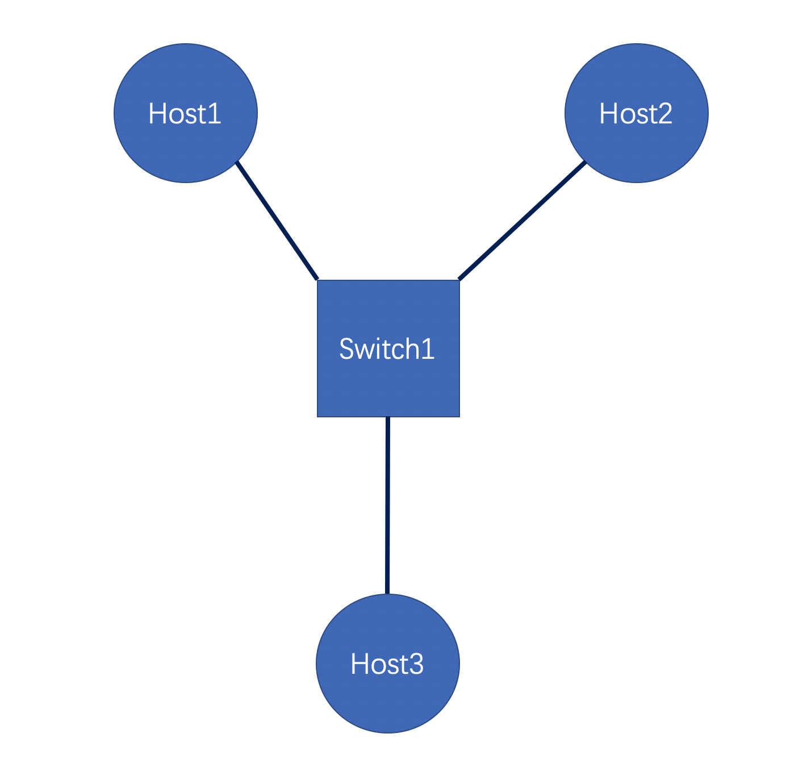

# 									    Lab4 实验文档

​																		    			**lab4 ddl：2023-01-06 23：59：59**


## 0.简介

在Lab4中，你需要实现一个可以进行简单的转发，广播以及转发表学习的简单二层交换机。


具体地，你需要将你的交换机类实现为一个C++的类，我们会使用一个单进程的模拟器来进行模拟与测试。这个模拟器将会实例化一个或多个你实现的交换机类对象，这些交换机将会与模拟器中的虚拟主机来组成虚拟的物理链路拓扑，模拟器将会调用你所实现的交换机类的接口来完成以太网帧的转发，广播以及交换机转发表的学习。


## 1.网络结构


为了简化lab，我们只对网络中的链路层进行考虑，我们做如下的约定：

1.对于网络中的每一台主机，**都有且仅有唯一**的一个MAC地址来进行标识。

2.在本次实验中仅涉及到链路层的帧传输，不会涉及网络层及以上层中的协议。

3.本次实验中只会进行单线程的模拟，不会涉及到多线程测试。


需要注意的是，我们将会采用模拟器来对网络环境进行模拟，而不是在真实的环境下进行测试，这意味着你并不需要使用socket来进行编程。


## 2. 功能要求


本节主要是对lab中所需要实现的交换机的功能进行描述。

简而言之，交换机在收到一个来自链路层的帧后，需要根据此帧头中的目的MAC地址来确定转发端口。

同时，交换机还应该通过更新此帧的入端口以及此帧的源MAC地址之间的映射关系，来自动学习交换机的转发表。


### 2.1 转发与转发表的学习

我们希望你的交换机能完成帧的正确转发，以及交换机的转发表的学习。

具体而言，你的交换机在从某个端口`inPort`接收到一个帧时，交换机将会检查帧的目的MAC地址，并在转发表中查找目的MAC地址对应的出端口`outPort`，你的交换机应当能处理如下的几种情况：

(1)若这是一个来自controller的控制帧，应当执行上面的指令后再将其丢弃。

(2) 若无法查找对应的转发端口号，则将此帧广播至其入端口以外的其他端口，同时记录入端口与帧的源MAC地址的映射关系。

(3) 若可以查找到对应的转发端口`outPort`，同时`outPort == inPort`，则应当将此帧丢弃。

(4) 若可以查找到对应的转发端口`outPort`，同时转发`outPort != inPort`，则将此帧转发至端口`outPort`。


### 2.2 交换机转发表的老化

我们希望你的交换机能实现老化功能。

具体而言，你的交换机应当能够对其转发表中的表项进行老化，从而适应具体的物理链路的状态变化。

转发表的每个表项 除了记录目的MAC 地址和对应出端口外，还需要一个时间戳。每次转发表学习，如果插入新表项就初始化时间戳，如果插入表项已存在就更新时间戳，这称为一次刷新。交换机可以设置老化时间，删除所有超过老化时间仍未刷新的表项。


为了模拟老化，你应该为每一个转发表的表项配上一个int类型的变量`counter`，并采用下面的方式实现老化：

- 在插入一个新表项时，将对应的`counter`初始化为10（对应老化时间10秒）；

- 在插入表项已经存在时，将对应的`counter`重新赋值为10；

- 在交换机收到来自Controller的`Aging`控制命令后，交换机将转发表中的所有表项的`counter`减1，同时将所有`counter`值为0的表项从转发表中清除。


我们不会使用多进程进行测试，这里对转发表的读写以及老化**不需要考虑多线程竞争的问题**。


### 2.3 Controller

Controller 用于通知交换机进行老化，它通过发送控制帧来实现这一功能。

**你不需要实现 Controller**，但为了进行测试，你实现的交换机类需要能够处理来自 Controller 的控制帧，并作出相应的操作。 Controller 的控制帧将和其他数据帧一样通过 Simulator 以调用类成员函数的方式传递给交换机。

我们将在 3. 3中具体描述控制帧的内容。


## 3. 技术规范

### 3.1 帧格式

在`Lab 4`中，每一个帧都由帧头+Payload组成，每个帧仅含有一个帧头。

为了区分来自于主机的帧与来自于controller的帧，我们将从主机发出的帧称为**数据帧**，将从controller发出的带有控制命令的帧叫做**控制帧**。**请注意：控制帧与数据帧在格式上均遵循本节中的帧格式**。




我们用6字节的uint8_t数组来表示MAC地址，为了使得MAC地址的声明更加具有可读性, 我们使用typedef来给MAC地址定义了别名	`mac_addr_t`，你可以在`types.h`中找到对应的代码片段。

```c
// In "types.h"
typedef uint8_t mac_addr_t[6];
```


`Lab 4`中的帧头遵循如下的定义，你同样可以在`types.h`中找到对应的代码片段。

```cpp
// In "types.h"

typedef struct {
  mac_addr_t ether_dest;
  mac_addr_t ether_src;
  uint16_t ether_type;
  uint16_t length;
} ether_header_t;
```


其中，`ether_dest`字段一共占6字节，为帧的**目的MAC地址**


`ether_src`字段占6字节，为帧的**源MAC地址**


`ether_type`字段占2字节，表示帧的类型。在`Lab4`中，会涉及到不同的两种帧：数据帧与控制帧，对应的是ether_type的如下2种可能的取值

```c
const uint16_t ETHER_DATA_TYPE = 0;
const uint16_t ETHER_CTRL_TYPE = 1;
```

对于`ETHER_DATA_TYPE`，这表明这是一个**数据帧**，其后面的payload包含host之间的通讯数据。

对于`ETHER_CTRL_TYPE`，此帧仅会由Controller发出，这表明此帧是一个**控制帧**，我们将在3.3中对控制帧进行介绍。


`length`字段占2字节，表示payload的长度。


**注意：`ether_type`与`length`均使用小端法来表示**


我们保证在测试中中每次发送的消息的大小最大不会超过**1500字节**，因此最终单个帧的总大小不会超过帧头的16字节 + 消息最大的1500字节 = **1516字节**


### 3.3 控制帧与控制指令

控制帧指的是交换机从Cntroller收到的，包含Controller的控制命令的帧。

控制指令指的是**控制帧**中包含的控制信息，你的交换机仅需要支持`AGING`这唯一一条控制指令。

交换机在收到此条指令后，应当立即对其所存储的转发表项进行老化。


在格式上，`AGING`指令**没有额外的payload**， 除了帧头外不带其他任何的信息，其帧头的length字段为0。


## 4.实现要求

### 4.1 交换机接口

为了便于进行测试，我们要求你**必须**按照给定的类接口来实现你的交换机程序。

具体而言，在下发的文件中的`switch.h`中定义了交换机的抽象类`SwitchBase`，如下面的代码片段所示。


```C++
class  SwitchBase {
public:
	virtual void InitSwitch(int numPorts) = 0;
	virtual int ProcessFrame(int inPort, char* framePtr) = 0;
}
```


你实现的交换机类必须继承上面的纯虚类，并对上面的两个纯虚函数进行实现。

下面会对这两个纯虚函数的参数以及其意义进行说明。


### 4.1.1 InitSwitch(int numPorts)

`InitSwitch`函数用于进行交换机状态的初始化，其中包含的参数意义如下：

- `numPorts`表示此交换机的端口的数量，保证`numPorts`大于0


**注意：与Lab3一致，我们约定端口号从1开始进行编号，特别地，每个交换机的1号端口均与Controller相链接。**


### 4.1.2  ProcessFrame(int inPort, char* framePtr)

`ProcessFrame`函数负责交换机接收到的帧进行处理与转发，其中包含了两个参数：

- `inPort`表示收到的帧的入端口号

- `framePrt`是一个指针，表示收到的帧，其中帧的格式满足3.1中规定的格式

  

`ProcessFrame`的返回值表示的是这个帧应当被转发到的端口号，特别地

- 返回的端口号为`-1`，表示此帧应当被丢弃。
- 返回的端口号为`0`，表示此帧应当被广播到除了入端口外的其他端口上。


**注意：**

**1.请不要在ProcessFrame函数内部对framePtr进行释放。**

**2.交换机在处理完来自控制器的AGING帧后，应当直接丢弃此帧。即对于来自controller的控制帧，你的交换机的ProcessFrame函数应当返回-1。**


## 4.2 模拟器的工作流程

下面我们将对模拟器的工作流程进行介绍，模拟器会按照上面约定的接口来对你实现的交换机进行调用。

在进行测试时，模拟器将会基于如下的逻辑进行：


1. Simulator 创建 Controller
2. Simulator 根据对应的物理拓扑，多次调用`CreateSwitchObject`函数来生成多个交换机实例，并调用`InitSwitch`函数来完成各个交换机的初始化。
3. 对于每一个交换机，Simulator会先检查其对应的buffer中有没有未处理的帧，如果有，则会调用`ProcessFrame`函数来对此帧进行处理，这里的处理可能会是将帧广播/转发/丢弃中的其中一种行为。
4. 测试程序在正式开始测试前，保证会先对网络中的主机两两之间进行消息的发送，以确保每个交换机上面都能学习到正确的端口转发（此时不会进行测试）
5. 测试程序在正式开始测试时，会生成一些随机的Payload并组装成帧用于测试。同时，Simulator将会对这些帧的转发路径进行追踪。
6. 测试程序会检查这些帧是否被正确转发。


在第 1, 2 步中， Simulator 通过创建一个 Controller 实例和多个 交换机实例来模拟实机环境。为了使 Simulator 能够创建你定义的 switch类，我们在 `switch.h` 中声明了一个辅助函数

```cpp
SwitchBase *CreateSwitchObject();
```


**你应当对此函数进行实现，同时，此函数应该满足每次调用都会创建一个新的你所实现的Switch实例，并且返回此指针**，例如，假设你所实现的交换机类是`EthernetSwitch`


```cpp
class EthernetSwitch : public SwitchBase {
public:
  void InitSwitch(int numPorts) override { /* your implementation ... */ }
	int ProcessFrame(int inPort, char* framePtr) override { /* your implementation ... */ }
};
```


那么你应当实现如下的函数

```cpp
SwitchBase * CreateSwitchObject() {
	return new EthernetSwitch();
}
```


## 5. 本地测试与运行

我们采用与`lab3`一致的方式来进行代码的本地测试与运行。

我们提供了自动测试的程序，在接受 Github Classroom 邀请后每位同学有独立的 Github 仓库。

如果无法正常进行测试，请和助教联系。


### 5.1. 获取仓库

1. 从远程仓库 clone

2. 在根目录中执行 `git submodule update --init`

3. 在根目录中执行 `git submodule update --remote`

4. 在根目录中执行 `mkdir build`

   

### 5.2. 编译测试程序

我们提供了本地测试程序，如果需要在本地进行测试，请进行如下步骤：

1. 在根目录中执行 `cd test_local && mkdir build && cd build && cmake .. && make` ，这将编译本地测试程序
2. 将文件 `test_local/build/lab4_test` 拷贝到 `build/` 中，该操作只需在第一次获取测试程序或测试程序更新后执行

注意，若测试程序发生更新，请执行如下指令获取最新的测试程序（我们会在教学网和微信群进行通知）：

在根目录中执行 `git submodule update --remote` 并重新执行上述步骤 1，2


### 5.3. 编译你的程序

我们在模板仓库中下发了 CMake 模板，你可以修改 `CMakeList.txt` 以新增源文件。

**注意，在 `test_local` 目录下应该有下发静态库 `liblab4runtime.a` ，在编译前你需要将该文件拷贝到根目录的 `build/` 目录中**。

若` liblab4runtime.a` 发生更新，你需要在根目录中执行 `git submodule update --remote` 后重新将其拷贝到 `build/` 中。

我们将 `switch.cc` 也编译成静态库，并将 `liblab4runtime.a` 与 `libswitch.a` 链接到 `simulator` 以生成完整的模拟器可执行程序。 你可以通过在根目录的 `build` 目录中执行 `cmake.. && make` 命令，在本地编译生成 `simulator` 来运行并测试你的交换机。

请不要修改下发文件中的 `simulator.cc` 并保证链接时 `liblab4runtime` 位于 `libswitch` 之前。否则将无法正常测试。


### 5.4. debug mode

为了便于调试，我们为 `simulator` 提供了 debug 模式。

你可以通过执行 `./simulator 0` 来运行 debug 模式。在该模式下，你可以认为 `simulator` 提供了一个运行 `controller` 与 `switch` 的模拟器，你可以通过下面列出来的指令进行调试


**注意，下述指令中 2-3 发送的帧直接由controller来执行，并不会发送到交换机的buffer中 ；当执行 4/5/6/7 时会调用 `ProcessFrame()` 。而 8 则会立即调用 `ProcessFrame()` 并递归跟踪此帧转发路径**。


1. `new <num_port>`  创建一个新的交换机。与 `InitSwitch()` 的参数一致， `simulator` 将会返回创建的交换机的编号（正整数） 。该指令将会创建 Switch 实例并调用 `InitSwitch()` 进行switch的初始化。
2. `link <switch_id> <switch_id>` 连接由 1 中返回的交换机编号指定的两个交换机，其中端口号将由 controller 选择。
3. `addhost <switch_id> <addr>` 在对应交换机上连接一台 host ，其 MAC地址为 `<addr>` 。
5. `aging` 向所有交换机发送一条 `AGING`控制帧
6. `n` 使所有交换机从其对应的输入buffer获取一个帧并执行一次转发。
7. `ns` 不断执行 8 直到网络中不再有帧转发。
7. `warmup`对网络中的主机进行两两之间发送一段随机的消息，以便于在正式开始测试前，能使各个交换机学习到正确的端口转发规则。
8. `hostsend <src_addr> <dst_addr> <payload>` 从 host `<src_addr>` 发送一条目的地址为 `<dst_addr>` 的帧， `<payload>` 为可选字段。`simulator` 将会返回对应帧在此网络中的转发路径的长度，src_addr, dst_addr, payload。
9. `exit` 退出程序。


例如，下面的输入序列可以作为一个例子

```
new 4
addhost 1 de:ad:be:ef:00:01
addhost 1 de:ad:be:ef:00:02
addhost 1 de:ad:be:ef:00:03
warmup
hostsend de:ad:be:ef:00:01 de:ad:be:ef:00:02 HelloFromHost1ToHost2
```


第1-4行实际上建立起了如下的物理链路




第1行创建了一个有4个端口的交换机（注意：端口1留给controller）。

第2-4行中将MAC地址分别为de:ad:be:ef:00:01,de:ad:be:ef:00:02,de:ad:be:ef:00:03的三台主机与此交换机的剩余3个端口进行连接。

第5行通过`warmup`命令来进行Host1,2,3之间两两进行消息发送，对Switch1的转发表进行预热，使Switch1能学习到各个主机的正确转发端口。

第6行正式开始进行消息的发送。


## 6.测试样例说明

本次lab一共110分，部分测试点在deadline前放出，全部测试点会在deadline后统一进行测试。


### 6.1 测试样例说明

每一个测试点名由 `${类别}.${测试点名称}` 构成

所有的测试样例中的链路拓扑保证是连通的，只会有树形的链路拓扑（即不会出现环）。

所有测试样例中，保证交换机台数不超过20个，主机台数不超过100个。

在所有测试样例中，保证不会出现不合法的控制帧。


所有的测试用例中都将保证控制器所使用的的MAC地址不与其他主机的MAC地址冲突。


| 类别      | 测试点名称  | 分数 | ddl前放出 | 数据点内容                                   |
| --------- | ----------- | ---- | --------- | -------------------------------------------- |
| Topology1 | Forwarding  | 10   | 是        | 仅测试转发                                   |
| Topology1 | SwitchAging | 10   | 是        | 在转发正确的前提下，仅进行老化测试           |
| Topology2 | Forwarding  | 10   | 是        | 仅测试转发                                   |
| Topology2 | SwitchAging | 10   | 是        | 在转发正确的前提下，仅进行老化测试           |
| Topology3 | Forwarding  | 10   | 是        | 仅测试转发                                   |
| Topology3 | SwitchAging | 15   | 是        | 在转发正确的前提下，仅进行老化测试           |
| Topology4 | Forwarding  | 10   | 是        | 仅测试转发                                   |
| Topology4 | Mixed       | 15   | 是        | 边进行转发测试的同时，边对交换机进行老化测试 |
| Topology5 | Mixed       | 10   | 否        | 边进行转发测试的同时，边对交换机进行老化测试 |
| Topology6 | Mixed       | 10   | 否        | 边进行转发测试的同时，边对交换机进行老化测试 |


